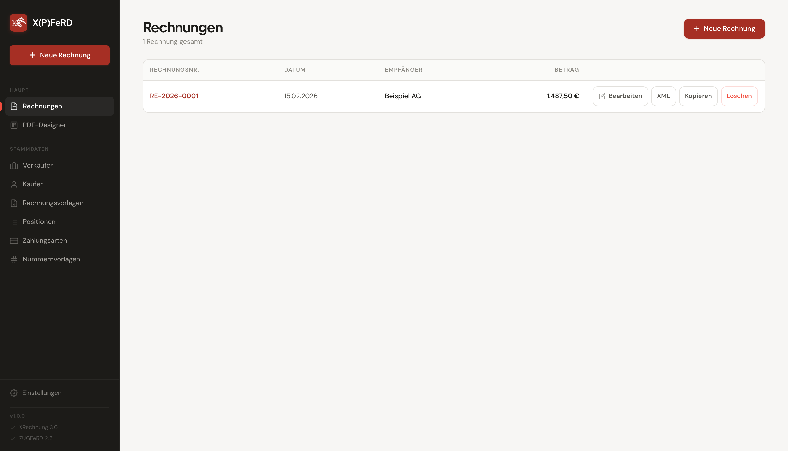
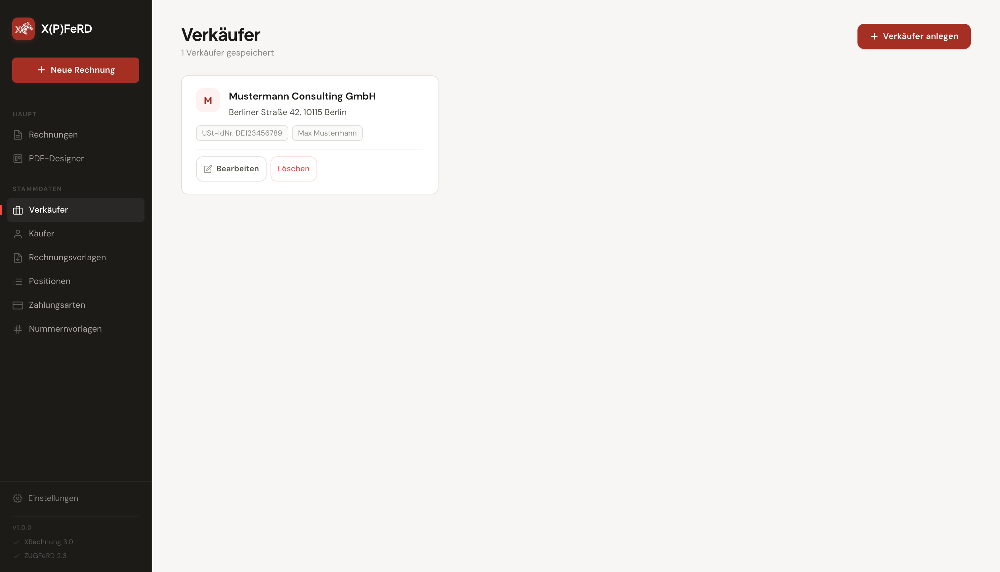
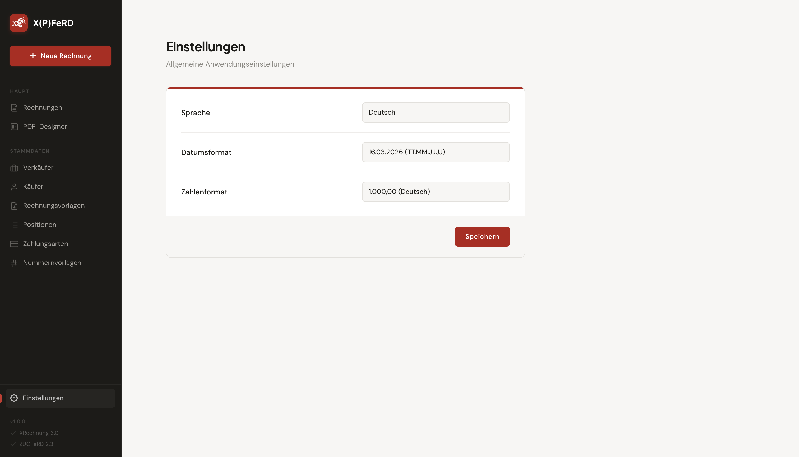
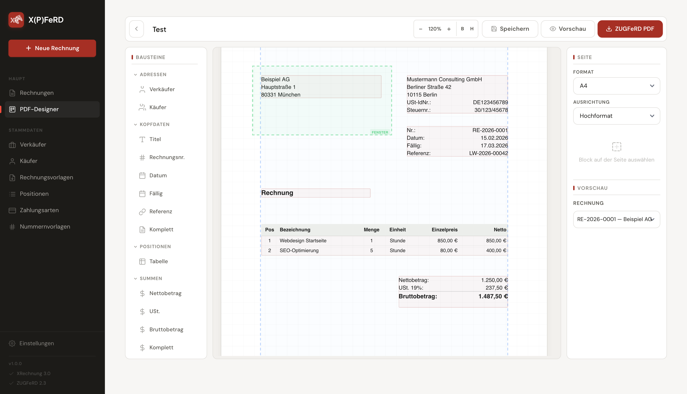

<p align="center">
    
</p>
<p align="center">
  <a href="https://github.com/tiehfood/xpferd/releases/latest">
    
  </a>
  <a href="https://hub.docker.com/r/tiehfood/xpferd">
    
  </a>
  <a href="LICENSE">
    
  </a>
  <a href="https://github.com/tiehfood/xpferd">
    
  </a>
  <a href="https://www.buymeacoffee.com/tiehfood">
    
  </a>
</p>

# X(P)FeRD

I needed a simple Application for creating, managing, and exporting XRechnung XML invoices and ZUGFeRD PDF invoices (German e-invoicing standard).
Especially the simple WYSIWYG PDF template editor is a feature I couldn't find a existing solution I liked.
So I build this little app (with a little help of AI, I will be honest 🙈).
It's probably not perfect, as I have only limited test data, but feel free to report any issues or submit PRs if you want to contribute.

## Features

- Create and edit invoices with all legally required fields for Germany
- Auto-calculated totals (net, tax, gross)
- Export invoices as XRechnung 3.0 compliant XML
- Design single page invoice PDF with WYSIWYG editor
  - Support for SVG logos
  - Use custom fonts (TTF/OFT)
  - Custom and common help lines (including envelope window, folding marks and borders)
- Export invoices as ZUGFeRD 2.1 compliant PDF (with embedded XML)
- Duplicate invoices or create from templates
- Swagger API documentation at `/api-docs`

## Screenshots
|  |  |
|:---------------------------------------------:|:---------------------------------------------:|
|  |  |


## Quick Start (Docker Compose)

```bash
# Development (hot-reload)
docker-compose up dev

# Production
docker-compose up production
```

The app is available at `http://localhost:3000`.

## Manual Docker Setup

```bash
# Build the dev image
docker build -f Dockerfile.dev -t xrechnung-dev .

# Start a persistent dev container
docker run -d --name xr-dev \
  -v "$(pwd):/app" \
  -p 3000:3000 \
  xrechnung-dev

# Install dependencies
docker exec xr-dev pnpm install

# Build the frontend
docker exec xr-dev node build-client.js

# Start the server
docker exec xr-dev npx tsx src/server/index.ts
```

## Running Tests

```bash
docker exec xr-dev npx vitest run
```

Or via Docker Compose:

```bash
docker-compose run --rm test
```

## Frameworks & Libraries
- **Application:** TypeScript, Svelte 5, Express
- **Database:** SQLite
- **PDF Generation:** @libpdf/core
- **XML Generation:** xmlbuilder2 (UBL 2.1 / XRechnung 3.0)
- **API Documentation:** Swagger-UI (`/api-docs`)
